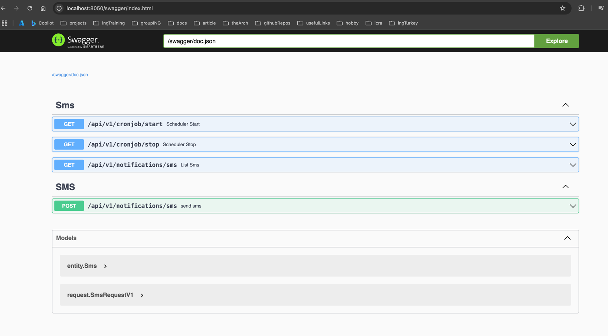

# Sms Sender Api

## Requirements
1. Redis

## Usage

```shell,
http://localhost:8050/swagger/index.html
```

You can run the application with the following command.

```shell,
docker-compose up -d
```

The application basically consists of 4 endpoints.

- /api/v1/cronjob/start - PATCH: This endpoint serves to start a cronjob.
- /api/v1/cronjob/stop - PATCH: This endpoint serves to stop a cronjob.
- /api/v1/notifications/sms - POST: This endpoint adds unsent status sms to the Redis database.
- /api/v1/notifications/sms - GET: This endpoint returns the list of sent SMSs.

